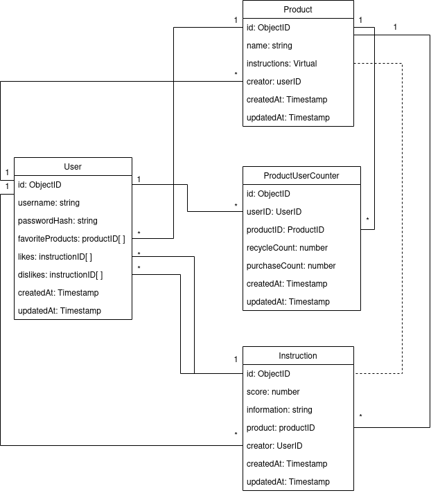

# Backend dokumentaatio

### API

| URI | Tyyppi | Kuvaus |
|---|---|---|
| api/products | GET | Palauttaa kaikki tuotteet |
| api/products/favorites | GET | Palauttaa käyttäjän suosikkituotteet |
| api/products/:id | GET | Palauttaa yhden tuotteen |
| api/products | POST | Lisää uuden tuotteen |
| api/products | POST | Lisää tuotteelle uuden ohjeen |
| api/products/:productId/instructions/:instructionId | DELETE | Poistaa kierrätysohjeen |
| api/products/:id | DELETE | Poistaa tuotteen |
| |||
| api/users | POST | Lisää käyttäjän |
| api/users/instructions/like | POST | Lisää tai poistaa annetun ohjeen käyttäjän tykkäyksistä |
| api/users/instructions/dislike | POST | Lisää tai poistaa annetun ohjeen käyttäjän ei-tykkäämistä |
| api/users/instructions/likes | GET | Palauttaa käyttäjän tykkäykset |
| api/users/instructions/dislikes | GET | Palauttaa käyttäjän ei-tykkäykset |
| api/users/products/:id | POST | Lisää tuotteen käyttäjän suosikkituotteisiin |
| api/users/products/:id | PUT | Poistaa tuotteen käyttäjän suosikkituotteista |
| |||
| api/login | POST | Kirjaa käyttäjän sisään |
| |||
| api/counters/user/product | POST | Lisää tai päivittää tuotteen kierrätys ja hankintatilastoja |
| api/counters/user/product?productID=tuotteen_id | GET | Palauttaa tuotteen kierrätysten ja hankintojen määrät |
| |||
| api/statistics/user/recyclingratesperproduct |  GET | Palauttaa listan käyttäjän kierrättämistä tuotteista ja niiden kierrätysmääristä |
| api/statistics/user/recyclingratesperday?end=päivämäärä&days=ajanjakson_pituus_päivinä&productID=tuotteen_id |  GET | Palauttaa taulukon kierrätysasteista annetulta ajanjaksolta, jos tuote on määritelty palautetaan yksittäisen tuotteen tiedot, muussa tapauksessa kaikkien tuotteiden kokonaiskierrätysaste |
| |||
| api/files/upload/product?id=tuotteen_id | POST | Tallettaa annetun kuvan tietokantaan ja lisää viitteen siihen annetun tuotteen tietoihin |
| api/files/images/:filename | GET | Hakee kuvan annetun tiedostonimen perusteella |
| |||
| api/admin/users | GET | Palauttaa kaikki käyttäjät |
| |||
| api/credentials?service=palvelun_tunniste | GET |  Palauttaa annettua palvelun tunnistetta vastaavan avaimen |

| Kun NODE_ENV === 'test' | | |
|---|---|---|
| api/tests/reset | POST | Poistaa tietokannasta käyttäjät, tuotteet ja kierrätysohjeet |

### Käynnistysohjeet

Tietokanta (mongodb) käynnistetään *server*-kansiossa komennolla `npm run start:mongo` (docker ja docker-compose tulee olla asennettuna)

Backend käynnistetään *server*-kansiossa seuraavin komennoin:

`npm start` kun devataan

`npm run start:test` kun testataan (Kannan tyhjentävä api-resurssi)

Tuotantoversio käynnistetään komennolla `npm run start:prod`

## Tietokantakaavio

