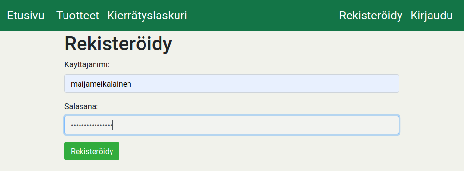
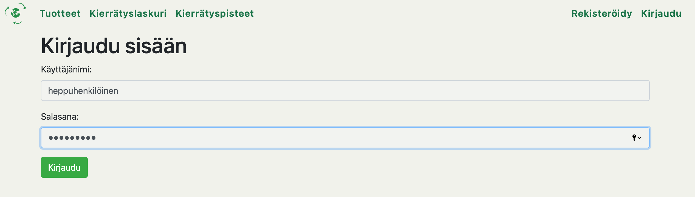
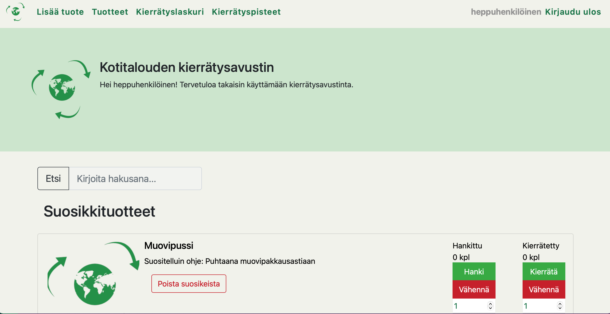
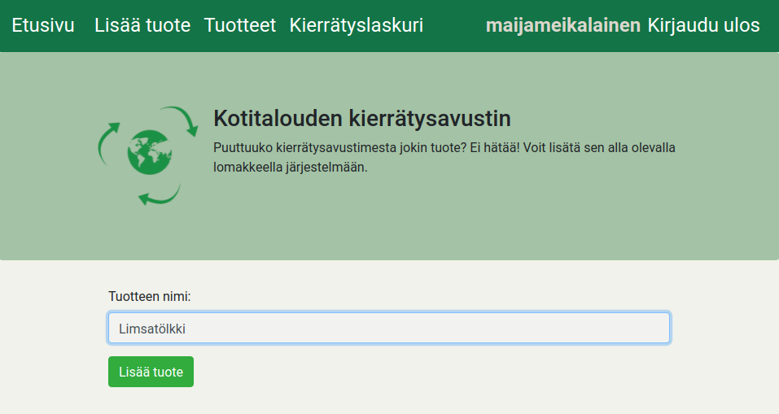
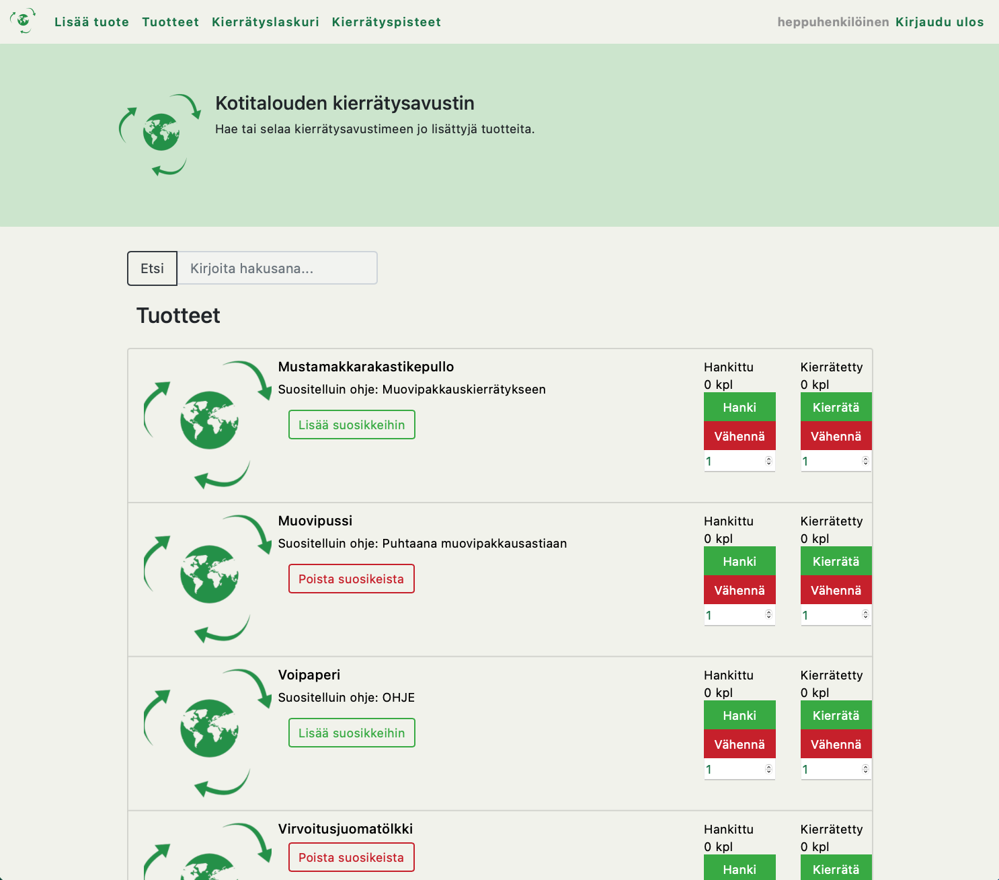
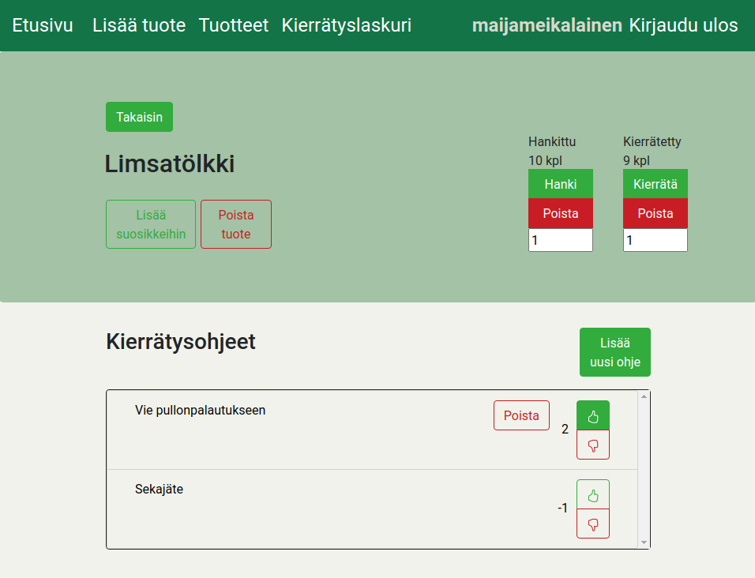
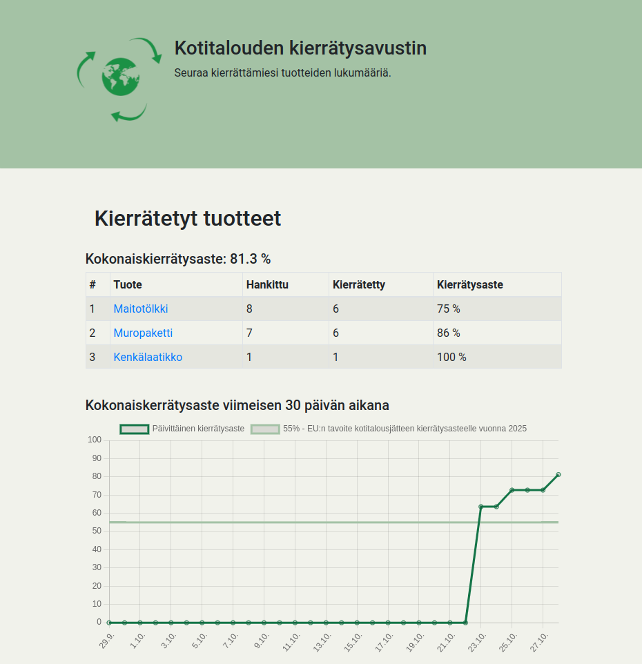
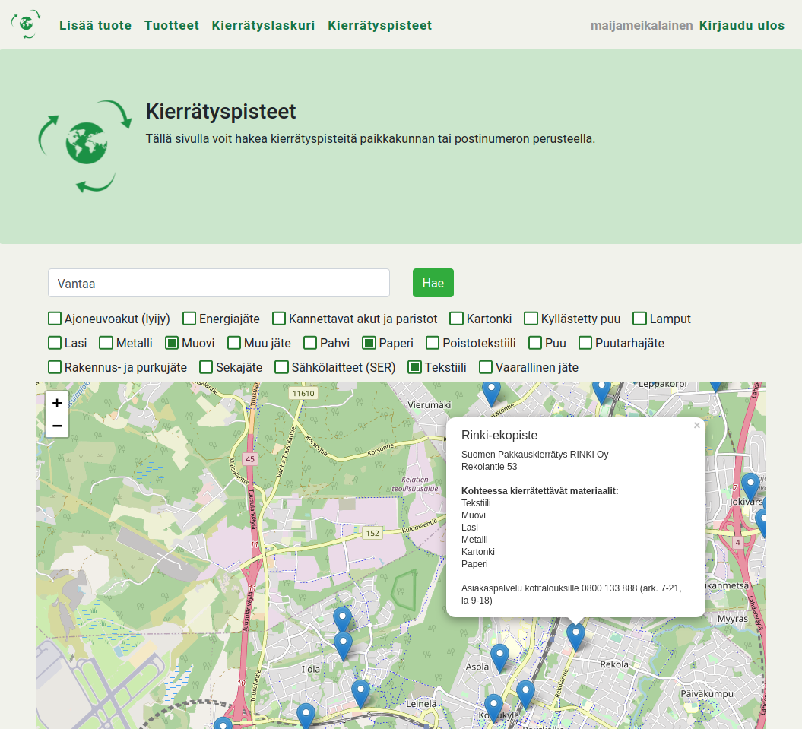

# Käyttöohje

Kotitalouden kierrätysavusatin on selainohjelma, jonka tarkoituksena on helpottaa kierrättämistä sekä tätä kautta nostaa kotitalouksien kierrätysasteita. Ohjelma sisältää tuotteita, joille käyttäjät voivat antaa erilaisia kierrätysohjeita. Kotitalouden kierrätysavustinta voi käyttää joko ilman kirjautumista tai kirjautuneena käyttäjänä. Ilman kirjautumista ohjelmaa voi käyttää rajoitetusti: tuotteita voi hakea ja tarkastella sekä kierrätysohjeita voi lukea.

## Rekisteröityminen

Järjestelmään voi luoda tunnukset ylävalikon kohdasta "Rekisteröidy" syöttämällä haluttu tunnus ja salasana.

## Kirjautuminen

Järjestelmään kirjaudutaan ylävalikon kohdasta "Kirjaudu" syöttämällä olemassa oleva tunnus ja salasana.

Uloskirjautuminen onnistuu klikkaamalla ylävalikosta "Kirjaudu ulos".

## Etusivu

Kun käyttäjä on kirjautunut, avautuu hänelle Kotitalouden kierrätysavustimen etusivu. Etusivulta löytyy muun muassa käyttäjän omat suosikkituotteet sekä hakukenttä, josta voi hakea järjestelmästä löytyviä tuotteita. Kirjautumattomalle käyttäjälle etusivulla näkyy ainoastaan hakukenttä.

## Tuotteen lisääminen

Kirjautumisen jälkeen on mahdollista lisätä tuotteita ylävalikon kohdasta
"Lisää tuote". Tuotetta lisätessä vaaditaan ainoastaan tuotteen nimi, mutta halutessaan voi käyttäjä myös lisätä tuotteesta kuvan tuotteen nimen alla olevalla tiedostovalitsimella. Käyttäjä voi lisätä omalle tuotteelleen kuvan myös jälkikäteen tuotenäkymässä.

## Tuotelistaus

Tuotelistausnäkymässä näkyy kaikki järjestelmässä olevat tuotteet ja käyttäjä voi hakea tuotteita hakukentästä. Kirjautuneelle käyttäjälle jokaisen tuotteen vieressä on pikanäppäimet tuotteen suosikkeihin lisäämiseen sekä hankkimiseen ja kierrättämiseen, jotta kierrätysasteen ylläpitäminen olisi mahdollisimman helppoa. Lisäksi mikäli tuote on käyttäjän itse lisäämä (kuvassa Limsatölkki on käyttäjän maijameikalainen lisäämä), pystyy käyttäjä myös poistamaan tuotteen näkymästä käsin.

## Yksittäisen tuotteen näkymä

Yksittäisen tuotteen näkymään pääsee valitsemalla tuotteen haku-, tuote- tai suosikkituotelistauksesta. Kirjautunut käyttäjä voi näkymässä lisätä tuotteen suosikkeihinsa, hankkia ja kierrättää kyseistä tuotetta ylläpitääkseen tietoa omasta kierrätysasteestaan sekä lisätä ja äänestää kierrätysohjeita. Kierrätysohjeista ylimpänä näkyy eniten käyttäjä-ääniä saanut ohje.

Mikäli tuote on käyttäjän itse lisäämä, voi hän lisätä tuotteelle kuvan sekä poistaa kyseisen tuotteen kokonaan. Vastaavasti myös käyttäjä voi poistaa itse lisäämiään kierrätysohjeita.

## Kierrätyslaskuri

Kirjautunut käyttäjä voi tilastoida, kuinka suuren osuuden hän on kierrättänyt hankkimistaan tuotteistaan. Tilastointi tapahtuu painamalla tuotelistauksessa, suosikkituotelistauksessa tai tuotenäkymässä "Hanki"-nappia aina, kun tuotteita hankitaan talouteen ja vastaavasti painamalla "Kierrätä"-nappia, kun tuotteita kierrätetään. Virheellisten syötteiden välttämiseksi voi hankintoja ja kierrätyksiä poistaa haluamansa määrän.

Siirtymällä navigointipalkista näkymään "Kierrätyslaskuri", pääsee käyttäjä tarkastelemaan omaa kierrätysastettaan kokonaisuudessa sekä tuotekohtaisesti. Kierrätysaste lasketaan suoraan käyttäjän antamien hankintojen ja kierrätysten perusteella. Omaa kokonaiskierrätysastettaan voi myös seurata sivulla näkyvän kuvaajan avulla, jossa esitetään viimeisen 30 päivän aikainen kokonaiskierrätysaste. Kuvaajassa on myös näkyvissä [EU:n asettama tavoite](https://www.europarl.europa.eu/news/fi/headlines/society/20180328STO00751/jatehuolto-eu-ssa) kotitalousjätteen uudelleenkäytölle ja kierrätykselle vuonna 2025.

## Kierrätyspisteet

Sekä kirjautunut että kirjautumaton käyttäjä voi hakea ja tarkastella Suomen kierrätyspisteitä yläpalkista löytyvällä Kierrätyspisteet-sivulla. Käyttäjä voi hakea kierrätyspisteitä alueittain joko paikkakunnan tai postinumeron perusteella sekä rajata hakua kierrätettävien materiaalien perusteella.

